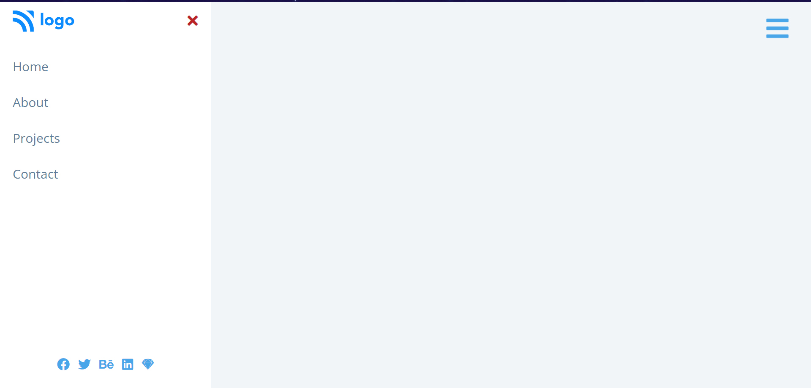

# Sidebar
Hi, this repository contains a Sidebar web application created using HTML, CSS, and JavaScript. The app features a sliding sidebar that contains navigation items, which appears when the user clicks on a hamburger icon. This project demonstrates DOM manipulation, event handling, and CSS transitions to create a smooth, interactive sidebar experience.

## [Live Preview](https://sidebar-css-js.netlify.app/)

Built with:

  

## Output:

